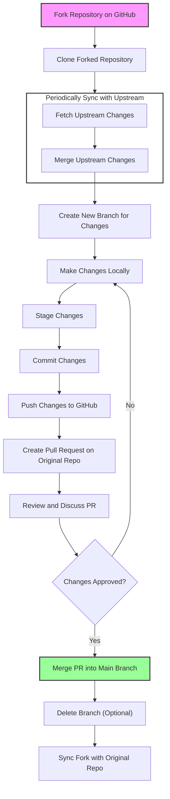

# Tutorial: Pull Request

## Forking a Repository

1. **Navigate to the GitHub Repository**: Open the GitHub page of the repository you want to contribute to.
2. **Fork the Repository**: Click the "Fork" button on the upper right corner. This creates a copy of the repository in your GitHub account.

## Cloning the Forked Repository

1. **Copy the Repository URL**: On your forked repository page, click the "Code" button and copy the URL.
2. **Clone Locally**: Open a terminal and run `git clone [URL]`, replacing `[URL]` with the copied URL. This downloads the repository to your local machine.

## Syncing the Fork with the Original Repository

1. **Add Remote Upstream**: In your local clone, add the original repository as a remote called `upstream` using `git remote add upstream [Original Repo URL]`.
2. **Fetch Upstream Changes**: Regularly run `git fetch upstream` to fetch changes from the original repository.
3. **Merge Upstream Changes**: Merge the changes from the `upstream/main` (or `upstream/master`) into your local branch using `git merge upstream/main`.

## Making Changes and Pushing to GitHub

1. **Create a New Branch**: Always create a new branch for your changes with `git checkout -b [branch-name]`.
2. **Make Your Changes**: Edit, add, and delete files as needed.
3. **Stage and Commit Changes**: Use `git add [file]` to stage changes and `git commit -m "commit message"` to commit them.
4. **Push to GitHub**: Push your branch to your forked repository with `git push origin [branch-name]`.

## Creating a Pull Request

1. **Navigate to the Original Repository**: Go to the GitHub page of the original repository.
2. **New Pull Request**: Click on "New Pull Request" and choose your branch.
3. **Describe Your Changes**: Fill in a detailed title and description for your changes.
4. **Submit Pull Request**: Click "Create Pull Request" to submit your changes for review.

## Reviewing Pull Requests

1. **Review Changes**: Maintainers and collaborators will review your changes, comment, and request any additional modifications.
2. **Make Requested Changes**: If changes are requested, make them in your branch and push them. The pull request will update automatically.

## Accepting and Merging the Pull Request

1. **Final Review and Merge**: Once the pull request is approved, the repository maintainer can merge your changes into the original repository.
2. **Merging the Pull Request**: The maintainer clicks "Merge Pull Request" and often chooses "Squash and Merge" to combine your commits into a single commit.

## Post-Merge

- **Delete Branch (Optional)**: After the merge, you may delete the branch from your fork if it's no longer needed.
- **Sync Fork**: Sync your fork with the original repository to reflect the merged changes.

## Conclusion 

This tutorial outlines a standard workflow for contributing to projects on GitHub. It emphasizes the importance of keeping your fork updated and collaborating effectively through pull requests and code reviews.

## Process Flow Diagram

The following flowchart is defined using Mermaid. Marmaid is a markdown language that can be embedded in Markdown documents and provides instructions for the renderer to display the mermaid code as a diagram. To see this mermaid code as a diagram in vscode, you must install the mermaid plugin. Also, you need to view a preview of the document (CTRL-K v)

