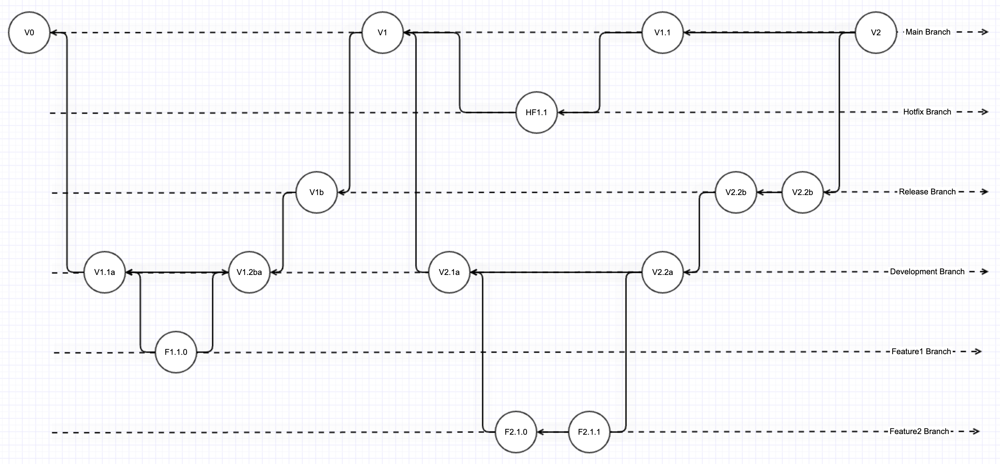

# Understanding Branching in Git

**1. Concept of Branching:**

- In Git, branches are essentially pointers to a specific snapshot (commit) in your project's history. They allow you to diverge from the main line of development (typically the `master` or `main` branch) and work on new features or fixes in isolation.

**2. Creation and Switching:**

- Creating a new branch (`git branch [branch-name]`) is a fast operation because Git only needs to create a new pointer, not duplicate code.
- Developers switch between branches using `git checkout [branch-name]`. This updates the files in your working directory to match the version stored in that branch.

**3. Independent Development:**

- Each branch is an isolated environment. Changes committed in one branch don't affect others, enabling multiple features or fixes to be developed in parallel.

**4. Merging Changes:**

- Once development on a branch is complete, it can be merged back into the main branch (e.g., `master` or `main`). This is often done through pull requests (PRs) in collaborative environments like GitHub, which also facilitates code review.

**5. Conflict Resolution:**

- Merging can result in conflicts if the same parts of the code have been modified in both the target branch and the merging branch. These conflicts must be manually resolved before the merge can be completed.

## Best Practices for Managing Multiple Developers

**1. Branch Naming Conventions:**

- Adopt a clear and consistent naming convention for branches. This could be feature-based (`feature/add-login`), issue tracker IDs (`issue-101-fix`), or user story based (`story-303-refactor-checkout`).

**2. Short-Lived Feature Branches:**

- Encourage developers to keep branches short-lived. This minimizes divergence from the main branch and reduces the complexity of merges.

**3. Regular Pull Requests and Code Reviews:**

- Implement a process where developers regularly submit pull requests for their branches. This promotes early feedback through code reviews and helps catch issues early.

**4. Continuous Integration (CI):**

- Utilize CI tools to automatically build and test code when branches are pushed or updated. This ensures that the code in branches does not break the existing functionality.

**5. Avoiding Direct Commits to Protected Branches:**

- Protect critical branches like `master` or `main` from direct commits. Developers should use branches and PRs to introduce changes, ensuring that all changes are reviewed and tested.

**6. Handling Merge Conflicts:**

- Educate developers on handling merge conflicts effectively. Encourage them to merge changes from the main branch into their feature branch frequently to reduce the likelihood of major conflicts.

**7. Documentation and Communication:**

- Maintain clear documentation about your branching strategy and ensure all team members are aware of the process. Good communication is key in managing a team of developers effectively.

By following these best practices, teams can leverage Git's powerful branching capabilities to enhance collaboration, improve code quality, and streamline the development process.

**8. Example Git Workflow:**

## Process Flow Diagram

