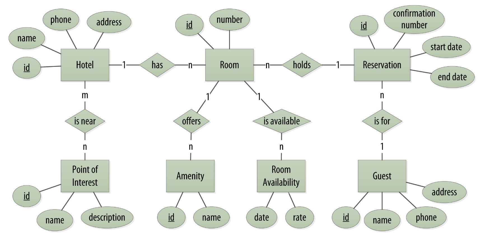
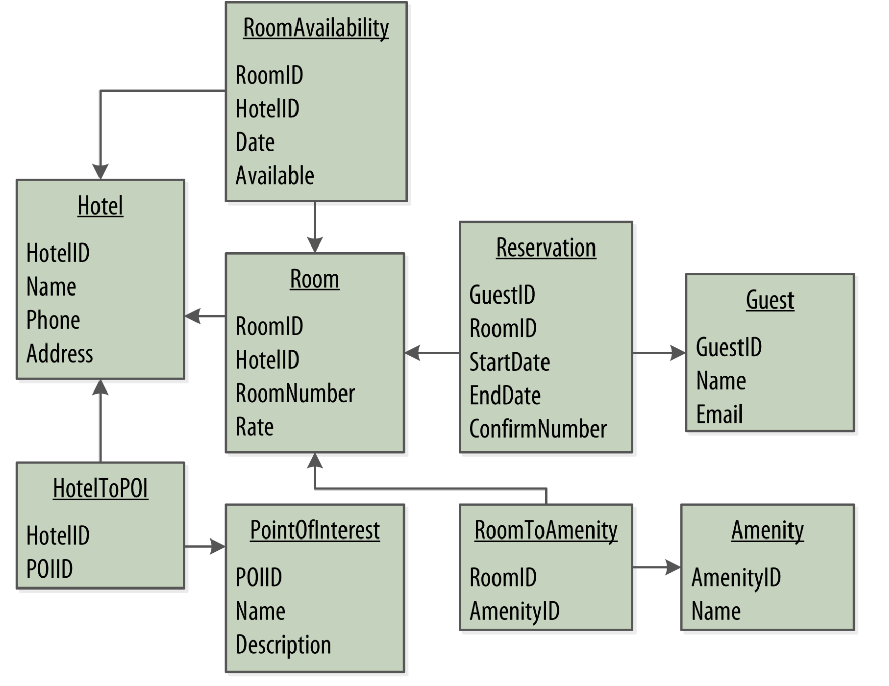
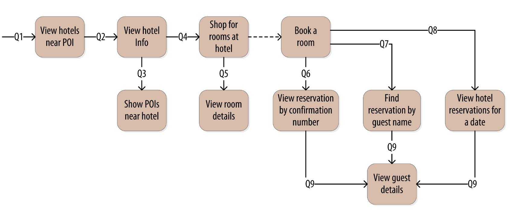
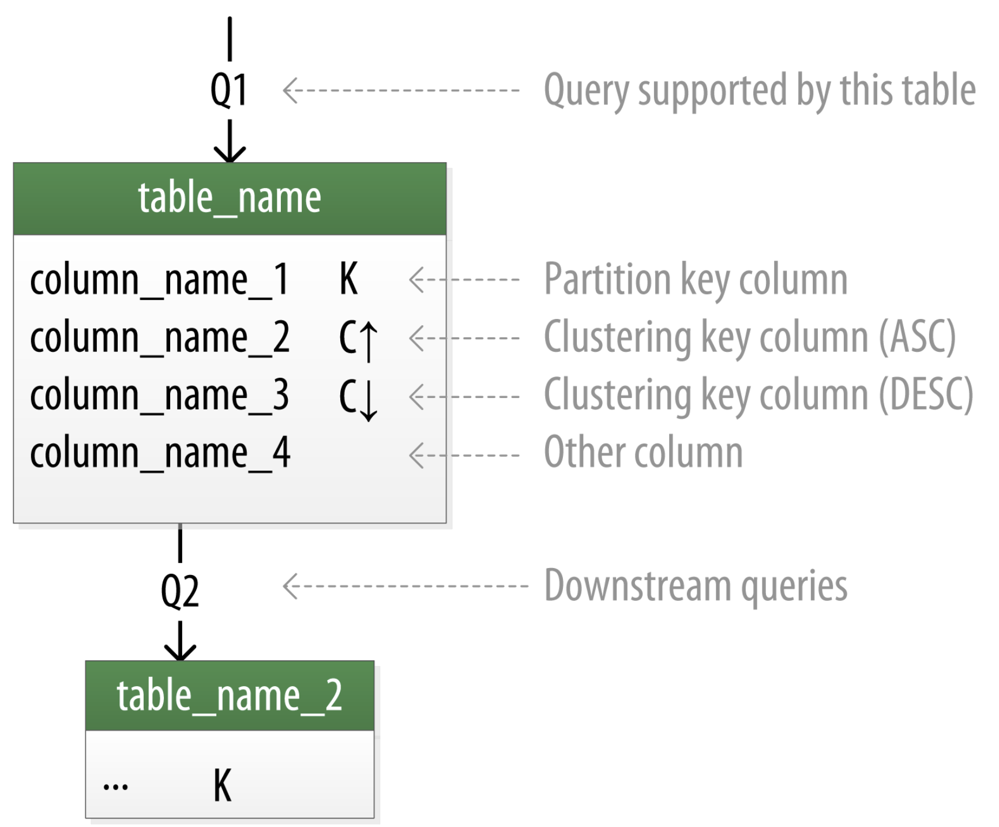
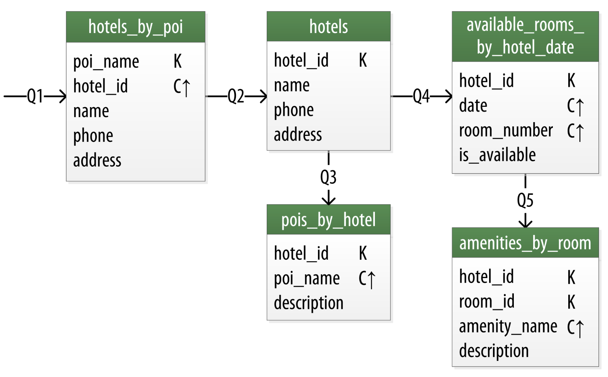
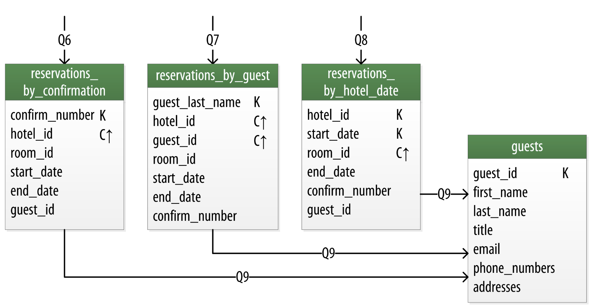
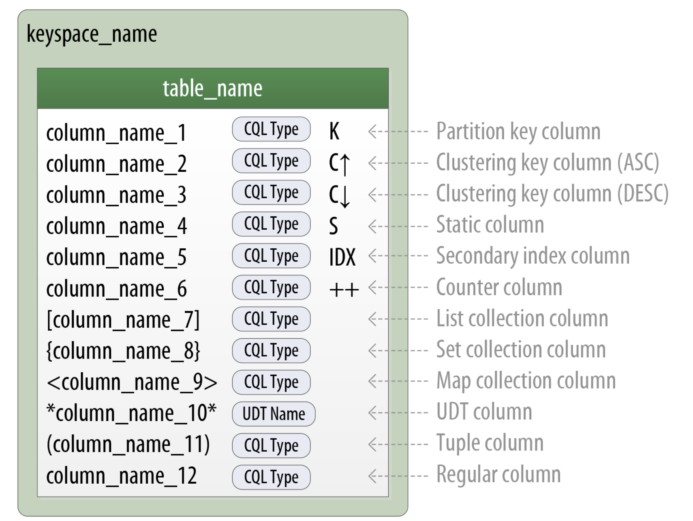
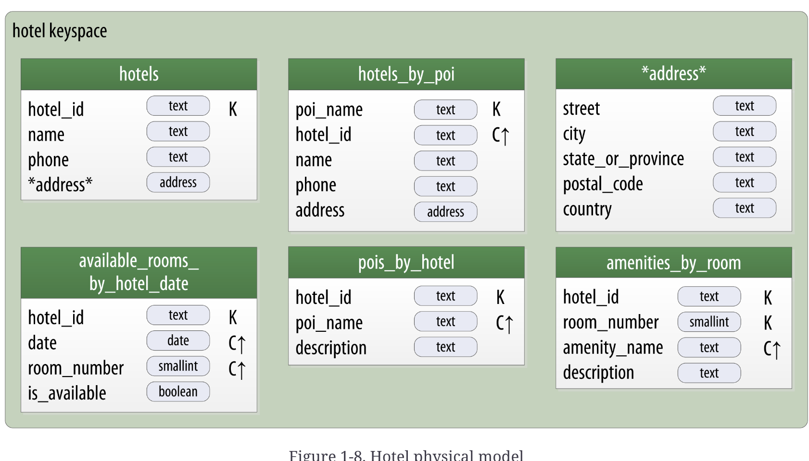
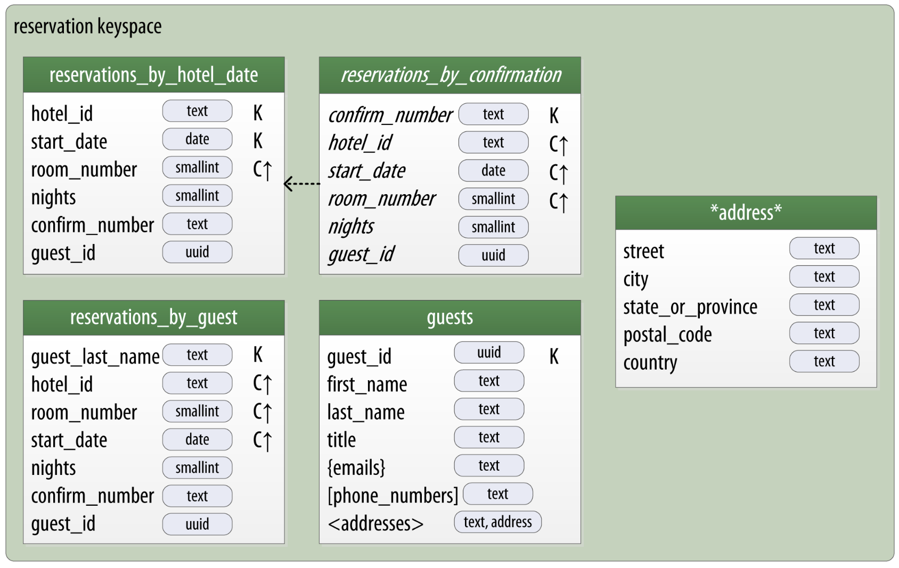

# Cassandra Application First Design

In this lesson, we will introduce the concept of application-first data modeling. This approach is a key part of the methodology we will use to design data models for Cassandra. We will also introduce the Chebotko notation, which we will use to represent our logical and physical data models.

## Conceptual Modeling

For our example, we’ll use a domain that is easily understood and that everyone can relate to: making hotel reservations.

This application domain encompasses hotels, the guests lodging in them, an assortment of rooms within each hotel, along with the pricing and availability of these rooms, and a log of guest reservations. It's common for hotels to also compile a list of "points of interest" nearby—such as parks, museums, shopping centers, monuments, and other attractions that guests might wish to explore during their stay. It's essential for both hotels and these attractions to have geographic data available, not only for representation on maps and integration into map-based applications but also to determine distances.

In our depiction, illustrated as Figure 1-1, we utilize the entity-relationship diagram approach, famously introduced by Peter Chen. This straightforward representation uses rectangles to denote entities within our domain and ovals for their attributes. Key identifiers for entities are emphasized with an underline. The relationships among entities are illustrated using diamond shapes, and the links connecting these diamonds to the entities indicate the relationship's multiplicity.


_Figure 1-1. Entity-relationship diagram for hotel reservation system_

In our hotel reservation system, we have the following entities:

## Relational Modelling Approach

When you set out to build a new data-driven application that will  use a relational database, you might start by modeling the domain as a set of properly normalized tables and use foreign keys to reference related data in other tables.


_Figure 1-2. A simple hotel search system using RDBMS_

## Design Differences Between RDBMS and Cassandra
Of course, because this is a Cassandra book, what we really  want is to model our data so we can store it in Cassandra.  Before we start creating our Cassandra data model, let’s take a minute to highlight some of the key differences in doing data modeling for Cassandra versus a relational database.

**No joins**:
You cannot perform joins in Cassandra. If you have designed a data model and find that you need something like a join, you’ll have to either do the work on the client side, or create a denormalized second table that represents the join results for you. This latter option is preferred in Cassandra data modeling. Performing joins on the client should be a very rare case; you really want to duplicate (denormalize) the data instead.

**No referential integrity**:
Although Cassandra supports features such as lightweight transactions and batches, Cassandra itself has no concept of referential integrity across tables. In a relational database, you could specify foreign keys in a table to reference the primary key of a record in another table. But Cassandra does not enforce this. It is still a common design requirement to store IDs related to other entities in your tables, but operations such as cascading deletes are not available.

**Denormalization**:
In relational database design, we are often taught the importance of normalization. This is not an advantage when working with Cassandra because it performs best when the data model is denormalized. It is often the case that companies end up denormalizing data in relational databases as well. There are two common reasons for this. One is performance. Companies simply can’t get the performance they need when they have to do so many joins on years’ worth of data, so they denormalize along the lines of known queries. This ends up working, but goes against the grain of how relational databases are intended to be designed, and ultimately makes one question whether using a relational database is the best approach in these circumstances.

A second reason that relational databases get denormalized on purpose is a business document structure that requires retention. That is, you have an enclosing table that refers to a lot of external tables whose data could change over time, but you need to preserve the enclosing document as a snapshot in history. The common example here is with invoices. You already have customer and product tables, and you’d think that you could just make an invoice that refers to those tables. But this should never be done in practice. Customer or price information could change, and then you would lose the integrity of the invoice document as it was on the invoice date, which could violate audits, reports, or laws, and cause other problems.

In the relational world, denormalization violates Codd’s normal forms, and we try to avoid it. But in Cassandra, denormalization is, well, perfectly normal. It’s not required if your data model is simple. But don’t be afraid of it.

> [!NOTE]
>
> **SERVER-SIDE DENORMALIZATION WITH MATERIALIZED VIEWS**
>
> Historically, denormalization in Cassandra has required designing and managing multiple tables using techniques we will introduce momentarily. Beginning with the 3.0 release, Cassandra provides a feature known as materialized views which allows us to create multiple denormalized views of data based on a base table design. Cassandra manages materialized views on the server, including the work of keeping the views in sync with the table. In this lesson, we’ll see examples of both classic denormalization and materialized views.

### Query-first design

Relational modeling, in simple terms, means that you start from the conceptual domain and then represent the nouns in the domain in tables. You then assign primary keys and foreign keys to model relationships. When you have a many-to-many relationship, you create the join tables that represent just those keys. The join tables don’t exist in the real world, and are a necessary side effect of the way relational models work. After you have all your tables laid out, you can start writing queries that pull together disparate data using the relationships defined by the keys. The queries in the relational world are very much secondary. It is assumed that you can always get the data you want as long as you have your tables modeled properly. Even if you have to use several complex subqueries or join statements, this is usually true.

By contrast, in Cassandra you don’t start with the data model; you start with the query model. Instead of modeling the data first and then writing queries, with Cassandra you model the queries and let the data be organized around them. Think of the most common query paths your application will use, and then create the tables that you need to support them.

Detractors have suggested that designing the queries first is overly constraining on application design, not to mention database modeling. But it is perfectly reasonable to expect that you should think hard about the queries in your application, just as you would, presumably, think hard about your relational domain. You may get it wrong, and then you’ll have problems in either world. Or your query needs might change over time, and then you’ll have to work to update your data set. But this is no different from defining the wrong tables, or needing additional tables, in an RDBMS.

### Designing for optimal storage

In a relational database, it is frequently transparent to the user how tables are stored on disk, and it is rare to hear of recommendations about data modeling based on how the RDBMS might store tables on disk. However, that is an important consideration in Cassandra. Because Cassandra tables are each stored in separate files on disk, it’s important to keep related columns defined together in the same table.

A key goal that we will see as we begin creating data models in Cassandra is to minimize the number of partitions that must be searched in order to satisfy a given query. Because the partition is a unit of storage that does not get divided across nodes, a query that searches a single partition will typically yield the best performance.

### Sorting is a design decision

In an RDBMS, you can easily change the order in which records are returned to you by using ORDER BY in your query. The default sort order is not configurable; by default, records are returned in the order in which they are written. If you want to change the order, you just modify your query, and you can sort by any list of columns.

In Cassandra, however, sorting is treated differently; it is a design decision. The sort order available on queries is fixed, and is determined entirely by the selection of clustering columns you supply in the CREATE TABLE command. The CQL SELECT statement does support ORDER BY semantics, but only in the order specified by the clustering columns.

## Defining Application Queries

Let’s try the query-first approach to start designing the data model for our hotel application. The user interface design for the application is often a great artifact to use to begin identifying queries. Let’s assume that we’ve talked with the project stakeholders and our UX designers have produced user interface designs or wireframes for the key use cases. We’ll likely have a list of shopping queries like the following:

- Q1. Find hotels near a given point of interest.
- Q2. Find information about a given hotel, such as its name and location.
- Q3. Find points of interest near a given hotel.
- Q4. Find an available room in a given date range.
- Q5. Find the rate and amenities for a room.

Now if our application is to be a success, we’ll certainly want our customers to be able to book reservations at our hotels. This includes steps such as selecting an available room and entering their guest information. So clearly we will also need some queries that address the reservation and guest entities from our conceptual data model. Even here, however, we’ll want to think not only from the customer perspective in terms of how the data is written, but also in terms of how the data will be queried by downstream use cases.

Our natural tendency as data modelers would be to focus first on designing the tables to store reservation and guest records, and only then start thinking about the queries that would access them. You may have felt a similar tension already when we began discussing the shopping queries before, thinking “but where did the hotel and point of interest data come from?” Don’t worry, we will get to this soon enough. Here are some queries that describe how our users will access reservations:

- Q6. Lookup a reservation by confirmation number.
- Q7. Lookup a reservation by hotel, date, and guest name.
- Q8. Lookup all reservations by guest name.
- Q9. View guest details.

We show all of our queries in the context of the workflow of our application in Figure 1-3. Each box on the diagram represents a step in the application workflow, with arrows indicating the flows between steps and the associated query. If we’ve modeled our application well, each step of the workflow accomplishes a task that “unlocks” subsequent steps. For example, the “View hotels near POI” task helps the application learn about several hotels, including their unique keys. The key for a selected hotel may be used as part of Q2, in order to obtain a detailed description of the hotel. The act of booking a room creates a reservation record that may be accessed by the guest and hotel staff at a later time through various additional queries.


_Figure 1-3. Hotel application queries_

## Logical Data Modeling

Now that we have defined our queries, we’re ready to begin designing our Cassandra tables. First, we’ll create a logical model containing a table for each query, capturing entities and relationships from the conceptual model.

To name each table, we’ll identify the primary entity type for which we are querying and use that to start the entity name. If we are querying by attributes of other related entities, we append those to the table name, separated with _by_. For example, hotels_by_poi.

Next, we identify the primary key for the table, adding partition key columns based on the required query attributes, and clustering columns in order to guarantee uniqueness and support desired sort ordering.

We complete each table by adding any additional attributes identified by the query. If any of these additional attributes are the same for every instance of the partition key, we mark the column as static.

Now that was a pretty quick description of a fairly involved process, so it will be worth our time to work through a detailed example. First, let’s introduce a notation that we can use to represent our logical models.

> [!NOTE]
> 
> **INTRODUCING CHEBOTKO DIAGRAMS**
> 
> Several individuals within the Cassandra community have proposed notations for capturing data models in diagrammatic form. We’ve elected to use a notation popularized by Artem Chebotko which provides a simple, informative way to visualize the relationships between queries and tables in our designs. Figure 1-4 shows the Chebotko notation for a logical data model.
>
> 
_> FIGURE 1-4. A CHEBOTKO LOGICAL DIAGRAM_

Each table is shown with its title and a list of columns. Primary key columns are identified via symbols such as K for partition key columns and C↑ or C↓ to represent clustering columns. Lines are shown entering tables or between tables to indicate the queries that each table is designed to support.

### Logical Data Model for Hotel Application

Figure 1-5 shows a Chebotko logical data model for the queries involving hotels, points of interest, rooms, and amenities. One thing we notice immediately is that our Cassandra design doesn’t include dedicated tables for rooms or amenities, as we had in the relational design. This is because our workflow didn’t identify any queries requiring this direct access.


_Figure 1-5. Hotel domain logical model_

Our first query Q1 is to find hotels near a point of interest, so we’ll call our table hotels_by_poi. We’re searching by a named point of interest, so that is a clue that the point of interest should be a part of our primary key. Let’s reference the point of interest by name, because according to our workflow that is how our users will start their search.

You’ll note that we certainly could have more than one hotel near a given point of interest, so we’ll need another component in our primary key in order to make sure we have a unique partition for each hotel. So we add the hotel key as a clustering column.

Now for our second query (Q2), we’ll need a table to get information about a specific hotel. One approach would have been to put all of the attributes of a hotel in the hotels_by_poi table, but we chose to add only those attributes that were required by our application workflow.

From our workflow diagram, we know that the hotels_by_poi table is used to display a list of hotels with basic information on each hotel, and the application knows the unique identifiers of the hotels returned. When the user selects a hotel to view details, we can then use Q2, which is used to obtain details about the hotel. Because we already have the hotel_id from Q1, we use that as our reference to the hotel we’re looking for. Therefore our second table is just called hotels.

Another option would have been to store a set of poi_names in the hotels table. This is an equally valid approach. You’ll learn through experience which approach is best for your application.

Q3 is just a reverse of Q1—looking for points of interest near a hotel, rather than hotels near a point of interest. This time, however, we need to access the details of each point of interest, as represented by the pois_by_hotel table. As we have done previously, we add the point of interest name as a clustering key to guarantee uniqueness.

At this point, let’s now consider how to support query Q4 to help our user find available rooms at a selected hotel for the nights they are interested in staying. Note that this query involves both a start date and an end date. Because we’re querying over a range instead of a single date, we know that we’ll need to use the date as a clustering key. We use the hotel_id as a primary key to group room data for each hotel on a single partition, which should help our search be super fast. Let’s call this the available_rooms_by_hotel_date table.

> [!NOTE]
> 
> **SEARCHING OVER A RANGE**
> 
> Use clustering columns to store attributes that you need to access in a range query. Remember that the order of the clustering columns is important.

In order to round out the shopping portion of our data model, we add the amenities_by_room table to support Q5.  This will allow our user to view the amenities of one of the rooms that is available for the desired stay dates.

### Reservation Logical Data Model

Now we switch gears to look at the reservation queries. Figure 1-6 shows a logical data model for reservations. You’ll notice that these tables represent a denormalized design; the same data appears in multiple tables, with differing keys.


_Figure 1-6. A denormalized logical model for reservations_

In order to satisfy Q6, the reservations_by_confirmation table supports the look up of reservations by a unique confirmation number provided to the customer at the time of booking.

If the guest doesn’t have the confirmation number, the reservations_by_guest table can be used to look up the reservation by guest name. We could envision query Q7 being used on behalf of a guest on a self-serve website or a call center agent trying to assist the guest. Because the guest name might not be unique, we include the guest ID here as a clustering column as well.

The hotel staff might wish to see a record of upcoming reservations by date in order to get insight into how the hotel is performing, such as what dates the hotel is sold out or undersold. Q8 supports the retrieval of reservations for a given hotel by date.

Finally, we create a guests table. This provides a single location that we can use to store our guests. In this case, we specify a separate unique identifier for our guest records, as it is not uncommon for guests to have the same name. In many organizations, a customer database such as our guests table would be part of a separate customer management application, which is why we’ve omitted other guest access patterns from our example.

## Physical Data Modeling

Once we have a logical data model defined, creating the physical model is a relatively simple process.

We walk through each of our logical model tables, assigning types to each item. We can use any data types, including the basic types, collections, and user-defined types. We may identify additional user-defined types that can be created to simplify our design.

After we’ve assigned our data types, we analyze our model by performing size calculations and testing out how the model works. We may make some adjustments based on our findings. Once again we’ll cover the data modeling process in more detail by working through our example.

Before we get started, let’s look at a few additions to the Chebotko notation for physical data models.

> [!NOTE]
> 
> **CHEBOTKO PHYSICAL DIAGRAMS**
> 
> To draw physical models, we need to be able to add the typing information for each column. Figure 1-7 shows the addition of a type for each column in a sample table.
> 
> The figure includes a designation of the keyspace containing each table and visual cues for columns represented using collections and user-defined types. We also note the designation of static columns and secondary index columns. There is no restriction on assigning these as part of a logical model, but they are typically more of a physical data modeling concern.
> 
> 
> _FIGURE 1-7. EXTENDING THE CHEBOTKO NOTATION FOR PHYSICAL DATA MODELS_

### Hotel Physical Data Model

Now let’s get to work on our physical model. First, we need keyspaces for our tables. To keep the design relatively simple, we’ll create a hotel keyspace to contain our tables for hotel and availability data, and a reservation keyspace to contain tables for reservation and guest data. In a real system, we might divide the tables across even more keyspaces in order to separate concerns.

For our hotels table, we’ll use Cassandra’s text type to represent the hotel’s id. For the address, we’ll create our own address type:

```sql
cqlsh:my_keyspace> CREATE TYPE address (
... street text,
... city text,
... state text,
... zip_code int);
```

We use the text type to represent the phone number, as there is considerable variance in the formatting of numbers between countries.

As we work to create physical representations of various tables in our logical hotel data model, we use the same approach. The resulting design is shown in Figure 1-8.


_Figure 1-8. Hotel physical model_

Note that we have also included the address type in our design. It is designated with an asterisk to denote that it is a user-defined type, and has no primary key columns identified. We make use of this type in the hotels and hotels_by_poi tables.

> [!NOTE]
> 
> **Taking Advantage of User Defined Types**
> 
> It is often helpful to make use of user-defined types to help reduce duplication of non-primary key columns, as we have done with the address user-defined type. This can reduce complexity in the design.
> 
> Remember that the scope of a UDT is the keyspace in which it is defined. To use address in the reservation keyspace we’re about to design, we’ll have to declare it again. This is just one of the many trade-offs we have to make in data model design.

### Reservation Physical Data Model

Now, let’s turn our attention to the reservation tables in our design. Remember that our logical model contained three denormalized tables to support queries for reservations by confirmation number, guest, and hotel and date. As we work to implement these different designs, we’ll want to consider whether to manage the denormalization manually or use Cassandra’s materialized view capability.

The design shown for the reservation keyspace in Figure 1-9 uses both approaches. We chose to implement reservations_by_hotel_date and reservations_by_guest as regular tables, and reservations_by_confirmation as a materialized view on the reservations_by_hotel_date table. We’ll discuss the reasoning behind this design choice momentarily.


_Figure 1-9. Reservation physical model_

Note that we have reproduced the address type in this keyspace and modeled the guest_id as a uuid type in all of our tables. 

## Materialized Views

Materialized views were introduced to help address some of the shortcomings of secondary indexes. Creating indexes on columns with high cardinality tends to result in poor performance, because most or all of the nodes in the ring need are queried.

Materialized views address this problem by storing preconfigured views that support queries on additional columns which are not part of the original clustering key. Materialized views simplify application development: instead of the application having to keep multiple denormalized tables in sync, Cassandra takes on the responsibility of updating views in order to keep them consistent with the base table.

Materialized views incur a small performance impact on writes in order to maintain this consistency. However, materialized views demonstrate more efficient performance compared to managing denormalized tables in application clients. Internally, materialized view updates are implemented using batching.

Similar to secondary indexes, materialized views can be created on existing tables.

To understand the syntax and constraints associated with materialized views, we’ll take a look at the CQL command that creates the reservations_by_confirmation table from the reservation physical model:

```sql
cqlsh> CREATE MATERIALIZED VIEW reservation.reservations_by_confirmation 
  AS SELECT * 
  FROM reservation.reservations_by_hotel_date
  WHERE confirm_number IS NOT NULL and hotel_id IS NOT NULL and
    start_date IS NOT NULL and room_number IS NOT NULL
  PRIMARY KEY (confirm_number, hotel_id, start_date, room_number);
```

The order of the clauses in the CREATE MATERIALIZED VIEW command can appear somewhat inverted, so we’ll walk through these clauses in an order that is a bit easier to process.

The first parameter after the command is the name of the materialized view—in this case, reservations_by_confirmation.  The FROM clause identifies the base table for the materialized view, reservations_by_hotel_date.

The PRIMARY KEY clause identifies the primary key for the materialized view, which must include all of the columns in the primary key of the base table. This restriction keeps Cassandra from collapsing multiple rows in the base table into a single row in the materialized view, which would greatly increase the complexity of managing updates.

The grouping of the primary key columns uses the same syntax as an ordinary table. The most common usage is to place the additional column first as the partition key, followed by the base table primary key columns, used as clustering columns for purposes of the materialized view.

The WHERE clause provides support for filtering. Note that a filter must be specified for every primary key column of the materialized view, even if it is as simple as designating that the value IS NOT NULL.

The AS SELECT clause identifies the columns from the base table that we want our materialized view to contain. We can reference individual columns, but in this case have chosen for all columns to be part of the view by using the wildcard *.

Now that we have a better understanding of the design and use of materialized views, we can revisit the prior decision made for the reservation physical design. Specifically, reservations_by_confirmation is a good candidate for implementation as a materialized view due to the high cardinality of the confirmation numbers—after all, you can’t get any higher cardinality than a unique value per reservation.

An alternate design would have been to use reservations_by_confirmation as the base table and reservations_by_hotel_date as a materialized view. However, because we cannot (at least in early 3.X releases) create a materialized view with multiple non-primary key column from the base table, this would have required us to designate either hotel_id or date as a clustering column in reservations_by_confirmation. Both designs are acceptable, but this should give some insight into the trade-offs you’ll want to consider in selecting which of several denormalized table designs to use as the base table.

## Defining Database Schema

Once we have finished evaluating and refining our physical model, we’re ready to implement the schema in CQL. Here is the schema for the hotel keyspace, using CQL’s comment feature to document the query pattern supported by each table:

```sql
CREATE KEYSPACE hotel
    WITH replication = {'class': 'SimpleStrategy', 'replication_factor' : 3};

CREATE TYPE hotel.address (
    street text,
    city text,
    state_or_province text,
    postal_code text,
    country text
);

CREATE TABLE hotel.hotels_by_poi (
    poi_name text,
    hotel_id text,
    name text,
    phone text,
    address frozen<address>,
    PRIMARY KEY ((poi_name), hotel_id)
) WITH comment = 'Q1. Find hotels near given poi'
AND CLUSTERING ORDER BY (hotel_id ASC) ;

CREATE TABLE hotel.hotels (
    id text PRIMARY KEY,
    name text,
    phone text,
    address frozen<address>,
    pois set<text>
) WITH comment = 'Q2. Find information about a hotel';

CREATE TABLE hotel.pois_by_hotel (
    poi_name text,
    hotel_id text,
    description text,
    PRIMARY KEY ((hotel_id), poi_name)
) WITH comment = 'Q3. Find pois near a hotel';

CREATE TABLE hotel.available_rooms_by_hotel_date (
    hotel_id text,
    date date,
    room_number smallint,
    is_available boolean,
    PRIMARY KEY ((hotel_id), date, room_number)
) WITH comment = 'Q4. Find available rooms by hotel / date';

CREATE TABLE hotel.amenities_by_room (
    hotel_id text,
    room_number smallint,
    amenity_name text,
    description text,
    PRIMARY KEY ((hotel_id, room_number), amenity_name)
) WITH comment = 'Q5. Find amenities for a room';
```
Similarly, here is the schema for the reservation keyspace:

```sql

CREATE KEYSPACE reservation
    WITH replication = {'class': 'SimpleStrategy', 'replication_factor' : 3};

CREATE TYPE reservation.address (
    street text,
    city text,
    state_or_province text,
    postal_code text,
    country text
);

CREATE TABLE reservation.reservations_by_hotel_date (
    hotel_id text,
    start_date date,
    end_date date,
    room_number smallint,
    confirm_number text,
    guest_id uuid,
    PRIMARY KEY ((hotel_id, start_date), room_number)
) WITH comment = 'Q7. Find reservations by hotel and date';

CREATE MATERIALIZED VIEW reservation.reservations_by_confirmation AS
    SELECT * FROM reservation.reservations_by_hotel_date
    WHERE confirm_number IS NOT NULL and hotel_id IS NOT NULL and
        start_date IS NOT NULL and room_number IS NOT NULL
    PRIMARY KEY (confirm_number, hotel_id, start_date, room_number);

CREATE TABLE reservation.reservations_by_guest (
    guest_last_name text,
    hotel_id text,
    start_date date,
    end_date date,
    room_number smallint,
    confirm_number text,
    guest_id uuid,
    PRIMARY KEY ((guest_last_name), hotel_id)
) WITH comment = 'Q8. Find reservations by guest name';

CREATE TABLE reservation.guests (
    guest_id uuid PRIMARY KEY,
    first_name text,
    last_name text,
    title text,
    emails set<text>,
    phone_numbers list<text>,
    addresses map<text, frozen<address>>,
    confirm_number text
) WITH comment = 'Q9. Find guest by ID';
```

## Summary

In this lesson, we introduced the concept of application-first data modeling, which is a key part of the methodology we will use to design data models for Cassandra. We also introduced the Chebotko notation, which we will use to represent our logical and physical data models. We discussed the differences between designing data models for Cassandra versus a relational database, and we introduced the concept of materialized views in Cassandra. Finally, we walked through the process of defining a database schema in CQL.
