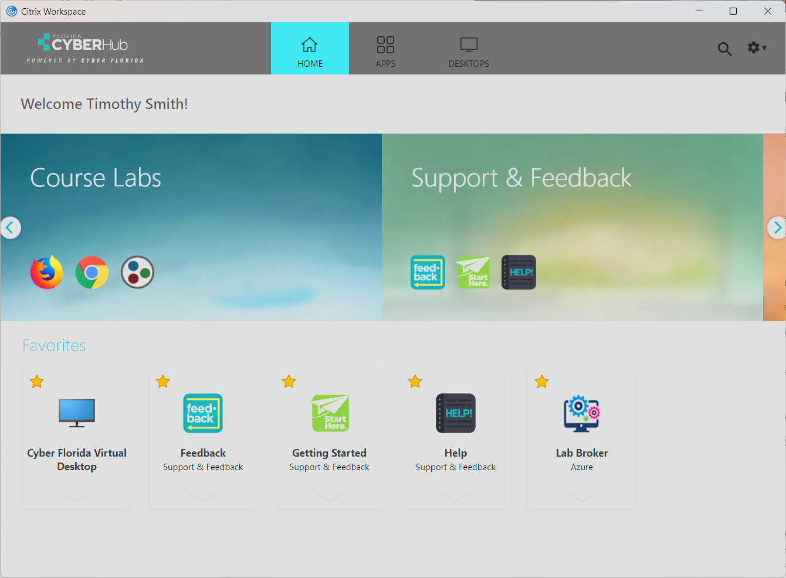
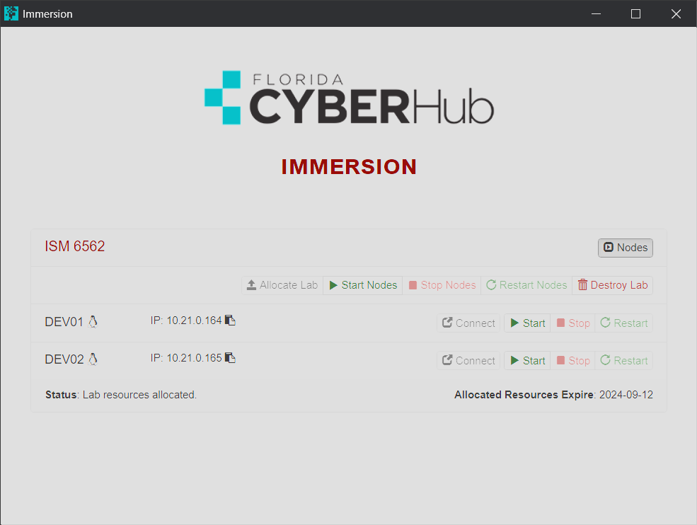
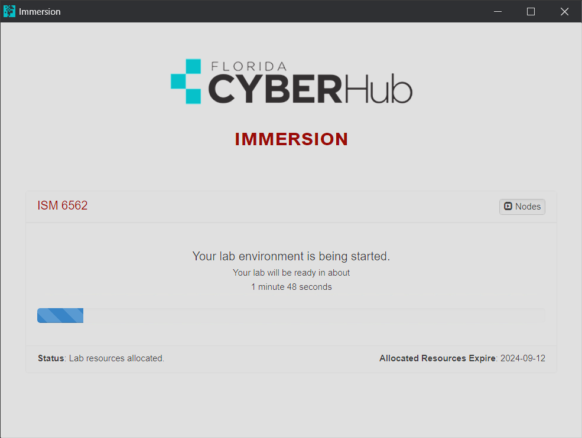
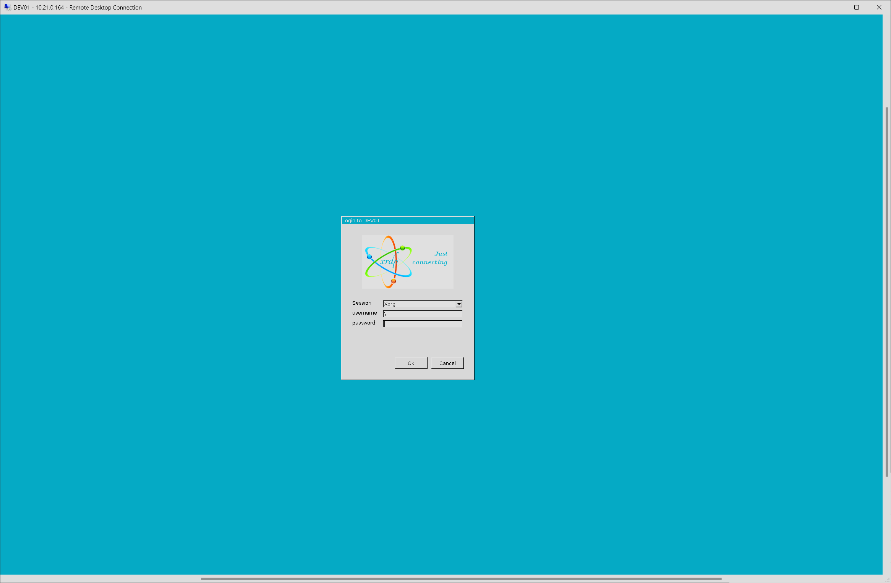

# C03 - Accessing CyberHub VM

The following are instructions on how to access the CuberHub VM. As we discussed in C04, using the CyberHub VM is not required. The CyberHub VM has 64GB of memory and an 8 core CPU. If you have an older computer, using the CyberHub VM will be much faster. 

> NOTE: If you use the CyberHub VM, you will need to install the Citrix Workspace App. Ths application allows you to connect to the desktop on the remote server: https://www.citrix.com/downloads/workspace-app/

- Step1: Donwload and install the application. https://www.citrix.com/downloads/workspace-app/
- Step2: Start Citrix Workspace App.
- Step3: Enter in `https://labs.floridacyberhub.org` in the pop-up dialogue box which asks "Enter your Store URL or email address".
- Step4: Enter in the username and password that would have been emailed to you (username is your USF email address, and password is the password you recieved via amail)
- Step5: Select "Lab Broker" icon

- Step6: First time starting, you will need to slect "allocate lab". This will create your CyberHub virtual machine.
- Step7: Start the CyberHub server

- Step8: You should not be see that you can click `Connect`

- Step 9: Click "Open in Windows Powershell", and accept allowing connections to this site.
- Step10: Login to the CyberHub Desktop using username `Admin` and password `123`

