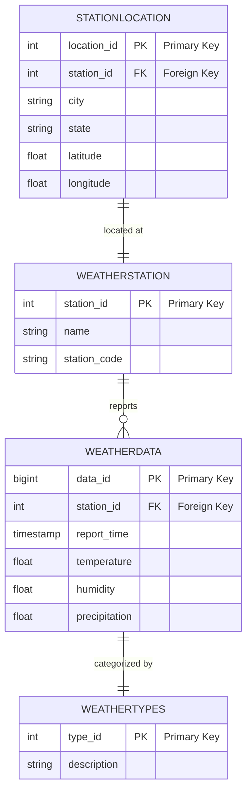

### Advanced Database Systems Assignment: Weather Data Collection and Management

#### Overview:

This team assignment involves designing and implementing a database system to collect, store, and manage a continuous stream of weather data from thousands of weather stations across the United States. Each weather station submits data every minute, leading to a vast amount of data that requires efficient handling, storage, and retrieval mechanisms.

#### Objectives:

1. Develop a scalable and robust database schema capable of handling high-frequency data streams from thousands of weather stations.
2. Utilize PostgreSQL across three servers (`postgres_node1`, `postgres_node2`, `postgres_node3`) to demonstrate distributed database management techniques suitable for real-time data ingestion and large-scale storage.
3. Ensure the database design supports data integrity, accuracy, and the timely retrieval of weather information. 

#### Requirements:

- **Database Schema**: Include tables for WeatherStations, WeatherData, and any other relevant entities such as StationLocation, WeatherTypes, etc. The WeatherData table is expected to grow significantly, requiring careful consideration of its structure and indexing strategies. The supplied example ERD diagram can be used as a starting point, but you are encouraged to expand and modify it as needed.
- **Sharding**: Decide on an appropriate sharding strategy for the WeatherData table across the three PostgreSQL servers. Consider the distribution method that will facilitate balanced data storage and efficient query processing.
- **Data Integrity**: Implement constraints and indexes to ensure the accuracy and integrity of the weather data, considering the high-frequency updates and inserts.
- **ERD Diagram**: Use MERMAID markdown to create an Entity-Relationship Diagram that clearly represents your database schema, focusing on the relationships between weather stations and their data submissions.

#### Submission:

Your submission should include:

1. A detailed report discussing your database schema, with a focus on handling high-frequency, large-volume data streams from the weather stations. Explain your partitioning and sharding strategies and their expected benefits.

2. SQL scripts for schema creation, including tables, partitions, sharding setup, indexes, and constraints.

3. Example SQL queries showcasing data insertion handling for real-time data streams, query optimizations for data retrieval, and any maintenance operations like partition management.

4. An ERD diagram in MERMAID markdown format representing the schema.

#### Rubric:

- **Database Schema (20%)**: Design completeness and effectiveness in handling large-scale, high-frequency data.
- **Partitioning and Sharding Implementation (30%)**: Technical correctness and efficiency of partitioning and sharding strategies.
- **Data Integrity and Performance Optimization (10%)**: Use of constraints, indexes, and other mechanisms to ensure data integrity and optimize system performance.
- **ERD Diagram (10%)**: Clarity and accuracy of the ERD in depicting the schema and data relationships.
- **Report and SQL Queries (10%)**: Depth and clarity of the report, and the correctness and efficiency of the provided SQL queries.
- **Use of GitHub (20%)**: Proper use of GitHub for version control, collaboration, and submission. You will use your team's GitHub repository to submit the assignment. All team members must show a contribution to the repository.

#### ERD Diagram (Example using MERMAID markdown):

In this schema, the `WEATHERDATA` table is expected to grow rapidly due to the high-frequency data submissions from thousands of weather stations. Partitioning this table by `report_time` and sharding across multiple PostgreSQL servers will be crucial for managing this large dataset effectively. Your report should detail these strategies, demonstrating your understanding of managing large-scale, real-time data in a distributed database environment. Write your report using Markdown and include the SQL scripts and MERMAID ERD diagram in the same document. (NOTE: See [Mermaid Cheatsheet](https://jojozhuang.github.io/tutorial/mermaid-cheat-sheet/), and [Markdown](https://www.markdownguide.org/cheat-sheet/) -- there are also tools available to create diagrams and export them to mermaid markdown.).